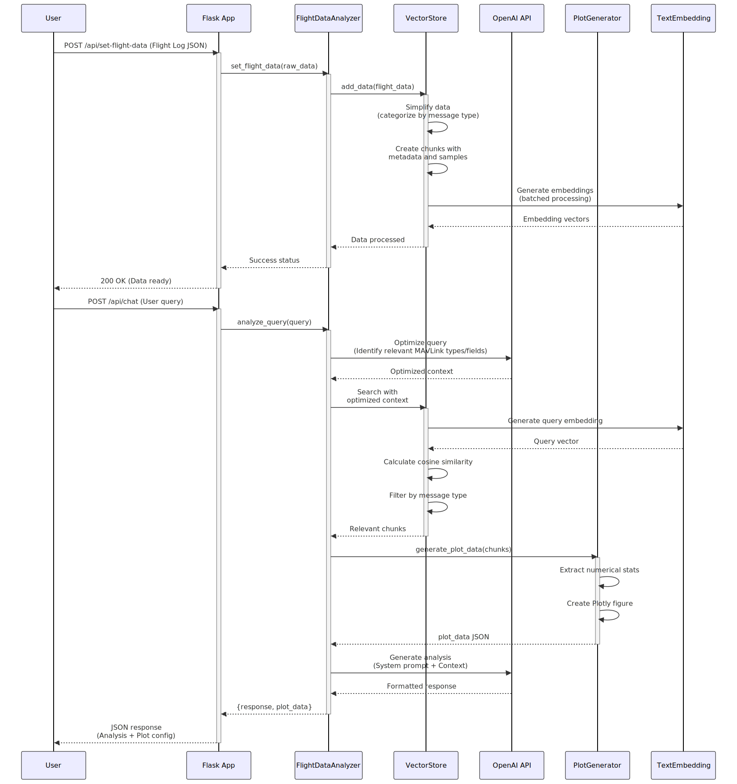

# UAV Log Viewer


 This is a Javascript based log viewer for Mavlink telemetry and dataflash logs.
 [Live demo here](http://plot.ardupilot.org).

## Build Setup

``` bash
# install dependencies
npm install

# serve with hot reload at localhost:8080
npm run dev

# build for production with minification
npm run build

# run unit tests
npm run unit

# run e2e tests
npm run e2e

# run all tests
npm test
```

# Docker

run the prebuilt docker image:

``` bash
docker run -p 8080:8080 -d ghcr.io/ardupilot/uavlogviewer:latest

```

or build the docker file locally:

``` bash

# Build Docker Image
docker build -t <your username>/uavlogviewer .

# Run Docker Image
docker run -e VUE_APP_CESIUM_TOKEN=<Your cesium ion token> -it -p 8080:8080 -v ${PWD}:/usr/src/app <your username>/uavlogviewer

# Navigate to localhost:8080 in your web browser

# changes should automatically be applied to the viewer

```

# LLM Chat Service Integration

This project extends the UAV Log Viewer with an intelligent chat interface powered by Large Language Models (LLMs). The chat service allows users to interact with their flight logs using natural language, making it easier to analyze and understand flight data.

## Architecture

The system consists of two main components:
- Frontend: Vue.js application (existing UAV Log Viewer)
- Backend: Flask-based chat service with LLM integration

### Key Features
- Natural language querying of flight logs
- Context-aware responses based on log data
- Real-time chat interface
- Support for complex flight data analysis queries

## Setup with Docker Compose

The easiest way to run the complete system is using Docker Compose:

```bash
npm install
# Create a .env file with your Cesium token and OPENAI_API_TOKEN
"VUE_APP_CESIUM_TOKEN= "your_token_here"
OPENAI_API_TOKEN= "your_token_here"


# Start the services
docker-compose up
```

This will start:
- Frontend service at http://localhost:8080
- Chat backend service at http://localhost:5001

## Development Setup

### Backend Setup
```bash
# Create and activate Python virtual environment
python -m venv venv
source venv/bin/activate  # On Windows: venv\Scripts\activate

# Install dependencies
pip install -r requirements.txt

# Run the Flask backend
flask run --port=5001
```

### Frontend Setup
```bash
# Install dependencies
npm install

# Run development server
npm run dev
```

## API Documentation

### Chat Service Endpoints

- `POST /api/chat`
  - Endpoint for sending messages to the LLM
  - Request body: `{ "message": "your question", "context": "optional log context" }`
  - Response: `{ "response": "LLM response", "context": "used context" }`

## Design Choices

1. **Microservices Architecture**
   - Separated frontend and backend for better scalability
   - Independent deployment and scaling of services
   - Clear separation of concerns

2. **LLM Integration**
   - Context-aware responses using flight log data
   - Efficient prompt engineering for accurate responses
   - Real-time processing of user queries

3. **Security**
   - Environment variables for sensitive data
   - Docker-based isolation
   - Secure API endpoints

## Technical Implementation Details

### Intelligent Log Data Processing

Our solution implements a sophisticated approach to handle large MAVLink log files while maintaining accurate LLM responses:

1. **Data Preprocessing Pipeline**
   - Converts raw log data into a structured format optimized for LLM consumption
   - Implements smart chunking based on message types and temporal relevance
   - Preserves critical flight data relationships while reducing redundancy

2. **Vector Store Implementation**
   - Uses advanced embedding models (BAAI/bge-small-en-v1.5 with fallback to sentence-transformers/all-MiniLM-L6-v2)
   - Implements efficient cosine similarity search for relevant context retrieval
   - Maintains semantic relationships between different message types

3. **Context Window Optimization**
   - Smart summarization of numerical data (min, max, avg, std)
   - Strategic sampling of data points (start, mid, end of flight)
   - Intelligent message type filtering based on query relevance

4. **Query Processing Pipeline**
   - Two-stage query optimization:
     1. Initial query analysis to identify relevant MAVLink message types
     2. Context-aware vector search to retrieve most relevant data chunks
   - Maintains conversation history for contextual continuity
   - Implements fallback mechanisms for model availability

### Key Technical Features

1. **Data Simplification**
   ```python
   def simplify_flight_data_for_llm(data):
       # Converts complex log data into LLM-friendly format
       # Maintains critical information while reducing size
   ```

2. **Smart Context Retrieval**
   ```python
   def search(self, query, k=5, relevant_message_types=None):
       # Implements efficient vector search
       # Filters by message type relevance
   ```

3. **Query Optimization**
   ```python
   def _optimize_query_with_docs(self, query):
       # Analyzes query against MAVLink documentation
       # Identifies relevant message types and fields
   ```

### Performance Optimizations

1. **Memory Efficiency**
   - Chunked processing of large log files
   - Efficient data structures for quick retrieval
   - Smart caching of frequently accessed data

2. **Response Quality**
   - Structured response format for consistent analysis
   - Cross-validation of data across message types
   - Clear separation of findings, analysis, and recommendations

3. **Error Handling**
   - Graceful fallback mechanisms for model availability
   - Robust error handling for malformed log data
   - Clear error messages for debugging

## Interactive Data Visualization

The system includes powerful data visualization capabilities that automatically generate relevant plots based on user queries:

### Plot Generation Features

1. **Automatic Plot Detection**
   - System identifies when numerical data visualization would be helpful
   - Intelligently selects relevant data fields based on query context
   - Generates appropriate plot types for different data patterns

2. **Supported Data Types**
   - Altitude data (GPS, AHR2, POS)
   - Battery statistics (voltage, current, consumption)
   - GPS position and accuracy metrics
   - Vibration levels
   - Attitude data (roll, pitch, yaw)
   - Time-series data

3. **Plot Types**
   - Box plots for statistical distributions
   - Time series for temporal patterns
   - Comparative plots for multi-sensor data
   - Custom visualizations based on query context

### Example Queries

The system can handle various types of data visualization requests:

1. **Altitude Analysis**
   ```bash
   "What was the altitude range during the flight?"
   "Show me the maximum and minimum altitude values"
   "What was the average altitude during the flight?"
   ```


2. **GPS Analysis**
   ```bash
   "What was the GPS position range?"
   "Show me the GPS altitude statistics"
   "What was the average GPS altitude?"
   ```


4. **Attitude Analysis**
   ```bash
   "What was the roll angle range?"
   "Show me the pitch statistics"
   "What was the average yaw angle?"
   ```

### Plot Integration

Plots are seamlessly integrated into the chat interface:
- Automatically generated when relevant to the query
- Displayed inline with the chat response
- Interactive features (zoom, pan, hover tooltips)
- Responsive design that adapts to chat window size

### Technical Implementation

The plotting system uses:
- Plotly.js for interactive visualizations
- Smart data parsing for numerical statistics
- Context-aware plot generation
- Efficient data structure for quick rendering

This implementation ensures that even with large log files, the system can provide accurate, contextually relevant responses while staying within LLM context window limitations.

## System Flow



## License

This project is licensed under the MIT License - see the LICENSE file for details.
